> [!WARNING]
> Note: This chapter and code repository is under early preview and may be updated between now and when the complete book is published.

<div style="clear: both;"></div>

<div style="display: flex; align-items: center;">

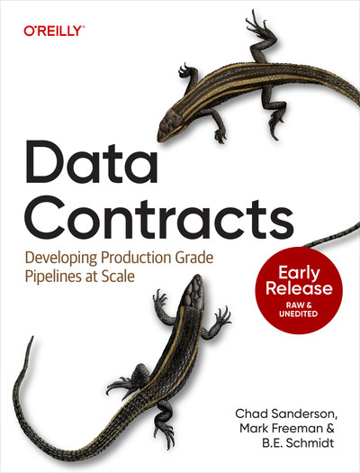

<div style="flex: 1;">

Welcome to the code repository for the hands-on coding exercise within ***Chapter 7: Implementing Data Contracts***, from the the O'reilly book ***Data Contracts: Developing Production Grade Pipelines at Scale***.

In this repo we will introduce you how to implement the data contract architecture end-to-end using fully open-source tools, as well as walk you through the workflow of handling data contract violations. This is a compliment to the book, but you can also go through this end-to-end with repo alone.

Also a huge shout out to O'Reilly for allowing us to make this repository and Chapter 7 of the book public!

Finally, if you found this project helpful, please consider giving this repo a star as the support helps immensely.

</div>
</div>

<div style="clear: both;"></div>

> [!NOTE]  
> **You can access the full book via the following sources:**
> 
> - [Directly from O'Reilly Media's Platform (Paid)](https://learning.oreilly.com/library/view/data-contracts/9781098157623/)
>
> - [Purchase a physical copy on Amazon](https://www.amazon.com/Data-Contracts-Developing-Production-Pipelines/dp/109815763X)
>
> - [Download a free PDF of the entire book from sponsor (limited time)](https://www.gable.ai/data-contracts-book)  
> 
> In addition, please check out the book's accompanying website for additional resources: http://data-contract-book.com

---

# 📚 Table of Contents

TBD

# 📋 Prerequisites

This tutorial assumes intermediate to advance understanding of the following:

- SQL and database management

- Python

- Creating and executing unit tests

- Implementing continuous integration jobs

- Version control via git and GitHub

- Using the command line

While not required, having experience with the following is helpful:

- Docker

- Python-based database migrations

- Visual Studio Code dev containers

Though these are prerequisites, please note that we will provide technical instructions, concept explanations, and implementation considerations for your own use case outside of this tutorial. The above are assumptions made about our readers when creating this tutorial, but not blockers for success.

# 💻 Installation and Setup

This tutorial expects you to create pull requests, especially around the CI/CD components for contract violation detection and alerting. Thus, we strongly encourage first forking the repo

From there you have two options: 1) running the environment via GitHub codespaces (easiest), or cloning the repo and running via Docker and VS Code dev container (more control).

### 🛸 Option 1 - GitHub Codespaces (Easiest)

1. Go to the `main` branch of the project (here).
   
2. Scroll to the top and select the green `< > Code` button, then select the `Codespaces` tab.
   
3. Select `Create codespace on main` which will start a new tab creating a coding environment in your browser.
   
4. Codespaces automatically picks up the docker and devcontainer configuration files and runs them to setup Python, a Postgres database, install requirements, and seeding the database with data (this will 1-3 minutes).

Please refer to [GitHub Codespaces quickstart guide](https://docs.github.com/en/codespaces/quickstart) if you need further assistance.

> [!NOTE]
> GitHub codespaces is a paid feature, but provides a generous amount of free credits for any account at the time of writing this. For context, building this project and heavily using codespaces resulted in less than $5 of usage (well below the free credit limit). If this is an issue, we then suggest running this project locally via Option 2.

### ⛴️ Option 2 - Docker Desktop + VS Code (More Control)

1. Ensure you have [Docker Desktop](https://www.docker.com/get-started/) and [Visual Studio Code](https://code.visualstudio.com/download) installed on your machine.
   
2. Clone the repo to your local machine: `git clone https://github.com/gabledata/oreilly_book.git`
   
3. In your terminal, go to the cloned repo via `cd <path-to-cloned-repo>`
   
4. Ensure Docker Desktop is running and in your terminal enter the command `docker compose up`

    - If you need to completely reset the container, run `docker compose down -v --remove-orphans && docker compose up` (note: this will spin down and delete data for all containers, so bne careful if you have other containers outside this project)

5. Docker will then run the configuration files to setup Python, a Postgres database, install requirements, and seeding the database with data (this will 1-3 minutes).

6. After Docker is done running, open VS Code and ensure you have Microsoft's [*Container Tools for Visual Studio Code*](https://marketplace.visualstudio.com/items?itemName=ms-azuretools.vscode-containers) extension downloaded.
   
7. In VSCode enter the command pallet (`cmd + shift + p` or `alt + shift + p`) and enter `> Dev Containers: Attach to Running Container...`.
   
8. Select the container that includes `devcontainer-1` to attach to, which will then launch a new VS Code Window (give it a couple minutes to connect and setup).
   
9.  Go to `Start > Open` in the menu and go to the path `../workspace` (note that Docker mounts the project in a folder called `workspace` in the root directory).

# 📕 Chapter 7: Implementing Data Contracts

In chapters five and six we covered the four components of the data contract architecture in depth. In chapter seven we move from theory to actually implementing data contracts via open-source tools. In support of your learning, we have created a corresponding public GitHub repo that will provide a full sandbox environment with:

- A full walkthrough of a data contract architecture implementation and its corresponding scripts.

- Implementation of a data contract spec.

- A scenario project simulating a data contract violation workflow.

Note that while we highly encourage using the corresponding code repository, this chapter is sufficient as a standalone, where there will be architecture diagrams along with the corresponding tools, as well as highlights of relevant code snippets.

We aim for you to achieve the following by going through this chapter and related code repository:

1. Understand how to implement the four data contract components: 1) data assets, 2) data contract spec, 3) detection, and 4) prevention.

2. Create a data contract spec via JSON Schema as a means to understand how to evaluate available specs on the market or whether to build one your own for specific use cases.

3. Learn how to leverage the metadata of databases to create your own "data catalog" that you will compare data contract specs to.

4. Embed data contracts within unit tests for local testing and embedding within the CI/CD workflow.

5. Fully walk through the data contract violation workflow on a pull request.

Finally, we suggest the following three ways to learn with this resource going from simple to most involved:

***Sandbox Exploration***

- Read this chapter and then go explore the sandbox environment on your own.

***Follow Along***

- Follow along this chapter with an active sandbox environment on the side.

***Create Your Own Implementation***

- Leverage Chapters 5 and 6 to create your own implementation (how we created Chapter 7) and then compare it to the sandbox environment.

There is no right or wrong approach, and we often use a mix of the above approaches when learning new technology ourselves. In the next section, we will introduce the mock scenario that will frame the entire project and corresponding scripts.

## Mock Data Contract Scenario Intro

For this scenario, we are a data platform engineer supporting the backend software engineering team tasked with creating the OLTP database that will support a new product line of the entertainment software business. Specifically, it's an AI assistant to use at museums that leverages computer vision to identify objects, and then provide context specific information-- your own personal museum guide.

Of course the AI application is all aspirational, and the early work requires setting up the database to start processing images and relevant metadata of objects within museums. In addition to building the foundation of the application, this images data is essential for the downstream data science who are developing the models for the application.

Given the importance of this database to the soon-to-be built application, and the strong downstream dependency of the downstream data science team, you were able to get buy-in to implement data contracts; as other parts of the enterprise have experience data quality issues in similar scenarios (refer to Chapters 9-12 on how to build buy-in and adoption).

Thus, you create documentation on the dataset, the museum application, and the data pipelines you oversee that will be covered by the data contract implementation.

### Dataset

Though the ultimate goal is to have this application integrated with all major museums, the minimum-viable-product of this application will focus on New York City's The Metropolitan Museum of Art. Specifically, [*The Metropolitan Museum of Art Open Access* dataset](https://github.com/metmuseum/openaccess) which includes "...more than 406,000 hi-res images of public-domain works from the The Met collection, all of which can be downloaded, shared, and remixed without restriction."

Thus, to simplify your early development work, you have pulled a sample of ~3000 records from the [*The Metropolitan Museum of Art Collection API*](https://metmuseum.github.io/) (Museum API) and stored it as a JSON array to seed your Postgres database. As of right now, the database has the following schema pictured below where every table has the primary key `object_id`.

```txt
Met Museum Database Schema
==========================

                            ┌──────────────────────────────────┐
                            │             object               │
                            ├──────────────────────────────────┤
                            │ PK: object_id (Integer)          │
                            │     title (Text)                 │
                            │     artist_display_name (Text)   │
                            │     created_at (DateTime)        │
                            └──────────────────────────────────┘
                                            │
                                            │ object_id
                                            │
                ┌───────────────────────────┼─────────────────────────────┐
                │                           │                             │
                ▼                           ▼                             ▼
┌─────────────────────────────────┐ ┌─────────────────────────────────┐ ┌─────────────────────────────────┐
│        object_history           │ │    object_physical_properties   │ │      object_gallery_info        │
├─────────────────────────────────┤ ├─────────────────────────────────┤ ├─────────────────────────────────┤
│ PK: object_id (Integer)         │ │ PK: object_id (Integer)         │ │ PK: object_id (Integer)         │
│     period (Text)               │ │     medium (Text)               │ │     gallery_number (Text)       │
│     culture (Text)              │ │     dimensions (Text)           │ │     department (Text)           │
│     object_date (Text)          │ │     classification (Text)       │ │     accession_number (Text)     │
│     created_at (DateTime)       │ │     created_at (DateTime)       │ │     created_at (DateTime)       │
└─────────────────────────────────┘ └─────────────────────────────────┘ └─────────────────────────────────┘
                │                           │                             │
                └───────────────────────────┼─────────────────────────────┘
                                            │
                                            │ object_id
                                            │
                ┌───────────────────────────┼────────────────────────────────┐
                │                           │                                │
                ▼                           ▼                                ▼
┌─────────────────────────────────┐ ┌────────────────────────────────────┐ ┌─────────────────────────────────┐
│         object_tags             │ │        object_images               │ │       object_copyright          │
├─────────────────────────────────┤ ├────────────────────────────────────┤ ├─────────────────────────────────┤
│ PK: object_id (Integer)         │ │ PK: object_id (Integer)            │ │ PK: object_id (Integer)         │
│     tags (ARRAY[JSON])          | │     primary_image (Text)           │ │     primary_image (Text)        │
│     created_at (DateTime)       │ │     additional_images (ARRAY[text])│ │     is_public_domain (Boolean)  │
└─────────────────────────────────┘ │     created_at (DateTime)          │ |     created_at (DateTime)       │
                |                   └────────────────────────────────────┘ └─────────────────────────────────┘
                │                           │                                │
                └───────────────────────────┼────────────────────────────────┘
                                            │
                                            │ object_id
                                            │
                                            ▼
                            ┌─────────────────────────────────┐
                            │      object_api_metadata        │
                            ├─────────────────────────────────┤
                            │ PK: object_id (Integer)         │
                            │     metadata_date (DateTime)    │
                            │     created_at (DateTime)       │
                            └─────────────────────────────────┘
```

Note that in this mock scenario there is still a lot of work left to get to the final data model for the OLTP database, and this why you want data contracts to help track changes and expectations as they evolve with the application.

### Museum Application

The high level architecture of the museum application, as pictured in Figure 7-1 below, consists of a Postgres database that sources data from the Museum API. In addition, the Postgres database handles CRUD operations from the museum object product interface-- which is the main focus of development work right now.

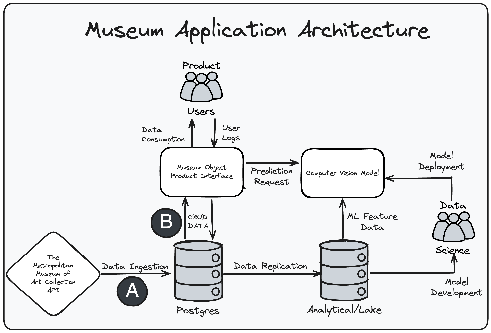
Figure 7-1: High level museum application architecture diagram

As highlighted in Figure 7-1, our only focus for this mock scenario is the data ingestion and CRUD operations labeled as "A" and "B" respectively. We can assume the replication pipeline and ML related activities are working as expected (as long as there are no data contract violations).

### Project Repo Overview

The below directory tree provides an overview of the data contract architecture implementation at the file level, as well as provide brief descriptions. At a high level, the project is composed of the following:

- Configuration files (e.g. docker-compose) for the sandbox environment and CI/CD workflows.
- A simple notebook as a lightweight means to query the Postgres database and test scripts.
- The data contract architecture itself, organized by its respective component/
  - Data Assets: Consist of the sample data, the script that pulled the data from the API, and the scripts for conducting database migrations.
  - Contract Definition: A folder where data contract specs are stored and detected.
  - Detection: Scripts that create a "data catalog" from database metadata, detect data contract specs, detect changes to the database, and detect data contract violations.
  - Prevention: Unit test script that allows testing for data contract violations locally and within CI/CD.

We suggest taking a moment to make yourself familiar with this directory tree before moving forward with the tutorial.

```txt
/workspace
├── .devcontainer.json                                             # VS Code dev container configuration
├── .gitignore                                                     # Git ignore rules
├── README.md                                                      # Project documentation
├── docker-compose.test.yml                                        # Docker compose for testing
├── docker-compose.yml                                             # Docker compose for development
├── requirements.txt                                               # Python dependencies
├── run_sql_queries_here.ipynb                                     # Jupyter notebook for SQL queries
├── .github/                                                       # GitHub configuration
│   └── workflows/                                                 # GitHub Actions workflows
│       └── docker-image.yml                                       # Docker image build workflow
└── data_contract_components/                                      # Data contract components
    ├── contract_definition/                                       # Data contract specifications
    │   ├── __init__.py                                            # Python package init
    │   └── object_images_contract_spec.json                       # Contract spec for object_images
    ├── data_assets/                                               # Data management and assets
    │   ├── __init__.py                                            # Python package init
    │   ├── _query_postgres_helper.py                              # PostgreSQL query helper
    │   ├── alembic.ini                                            # Alembic database migration config
    │   ├── seed_db.py                                             # Database seeding script
    │   └── db_migrations/                                         # Database migration files
    │       ├── __init__.py                                        # Python package init
    │       ├── env.py                                             # Alembic environment config
    │       ├── script.py.mako                                     # Alembic migration template
    │       ├── raw_data/                                          # Raw data files
    │       │   ├── __init__.py                                    # Python package init
    │       │   ├── get_data_subset_from_met_api.py                # Met Museum API data fetcher
    │       │   └── objects.json                                   # Met Museum objects data sample
    │       └── versions/                                          # Database migration versions
    │           └── 00e9b3375a5f_create_met_museum_seed_tables.py  # Migration to create tables
    ├── detection/                                                 # Data contract violation detection
    │   ├── __init__.py                                            # Python package init
    │   ├── _get_data_catalog.py                                   # Data catalog retrieval
    │   ├── _get_data_contract_specs.py                            # Contract specifications retrieval
    │   ├── _get_data_migration_changes.py                         # Migration changes detection
    │   ├── contract_coverage_detector.py                          # Contract coverage analysis
    │   └── contract_violation_detector.py                         # Contract violation detection
    └── prevention/                                                # Data contract violation prevention
        ├── __init__.py                                            # Python package init
        └── test_data_contract_violations.py                       # Contract violation tests
```

With the scenario established and background information provided, we will now move onto describing the data contract implementation in the subsequent sections.

## Implementing Data Contracts

As stated before in the mock scenario, this data contract implementation focuses on upstream data between ingestion from a third-party API (represented as the `data_assets/db_migrations/raw_data/objects.json` file) and the transactional database (i.e. Postgres) that will enable CRUD operations with the Museum Object Product Interface. For our first data contract, we are going to protect our most important data asset: `object_images`. This data asset is critical, as it's planned to surface pictures to the user once the machine learning model identifies a museum object from the user provided photo. In addition, `object_images.primary_image` and `object_images.additional_images` provide the text links used by the downstream data science team to access the image files for model training (outside the scope of this tutorial).

It's important to note, that while we tried to make as much of a realistic implementation as possible, the reality is that most companies are not going to be fully open-source or just using a single database. Thus, this implementation is intended to teach you the architecture *pattern* of data contracts that you can extrapolate to other tools within your respective use case. Furthermore, there are instances where we build tools that we could have integrated with a more robust external tool (e.g. data contract specs, data catalogs, etc.). This is intentional to help better illustrate the pattern of data contracts and manage simplicity for learners; but we will be sure to highlight where, so you can better evaluate what would be the best implementation and or integration for your use case.

### Data Contracts Architecture Overview

Recalling from Chapter 4, Figure 7-2 below illustrates the data contract workflow that we have implemented within our repository. Specifically, this workflow is broken up into four distinct components:

1. Data Assets
2. Contract Definition
3. Detection
4. Prevention

With this implementation, we are able to define our expectations for the `object_images` data asset via our contract spec, detect changes to the metadata within our postgres database (with special attention to `object_images`), compare our data contract spec to this metadata via a unit test, have this unit test run via CI/CD checks, and automatically alert of violations via a pull request comment.

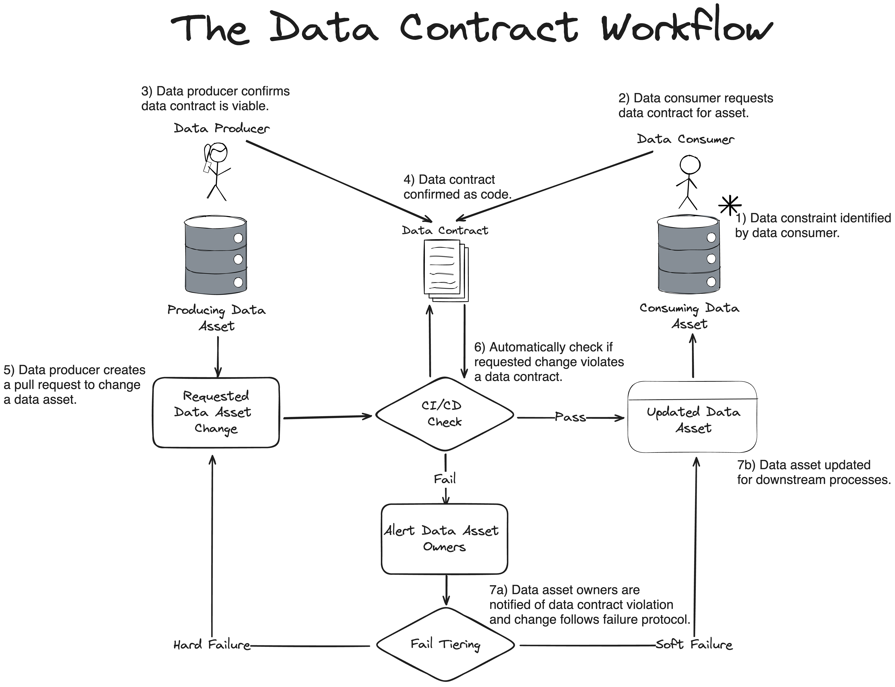
Figure 7-2: The Data Contract Workflow

In the subsequent sections, we will provide more detail on each respective component and discuss consideration one should take for their own implementation.

### Component A - Data Assets

The foundation of all data contracts are the data assets themselves. It's important to note that while you can explore seeded data within the database yourself, via `run_sql_queries_here.ipynb`, the data contract implementation only requires metadata to function. This is critical, as it greatly lowers the barrier needed for security implications to not read the actual data data, given that data contracts span across multiple departments (i.e. in this mock scenario: backend engineering, data platform engineering, and data science). The below code snippet is a subset of the full directory tree as it pertains to data assets.

```txt
/workspace
├── run_sql_queries_here.ipynb                                     # Jupyter notebook for SQL queries
├── docker-compose.test.yml                                        # Docker compose for development
└── data_contract_components/                                      # Data contract components
    └── data_assets/                                               # Data management and assets
        ├── _query_postgres_helper.py                              # PostgreSQL query helper
        ├── alembic.ini                                            # Alembic database migration config
        └── db_migrations/                                         # Database migration files
            ├── env.py                                             # Alembic environment config
            ├── script.py.mako                                     # Alembic migration template
            └── versions/                                          # Database migration versions
                └── 00e9b3375a5f_create_met_museum_seed_tables.py  # Migration to create tables
```

At a high level, our `docker-compose.test.yml` file is Docker's instructions for setting up the devcontainer, postgres database, and data assets. As illustrated in Figure 7-3, containers with Postgres and Python are spun up respectively at the same time, and once the database returns a "healthy" check from Postgres, the Python container (i.e. `devcontainer`) executes the database migration to create all of our tables for our application's transactional database within the Postgres container (i.e. `postgres`). Next to the diagram in Figure 7-3 is also a code snippet from the database migration file `data_assets/db_migrations/versions/00e9b3375a5f_create_met_museum_seed_tables.py` creating the `object_images` table and assigning schema and primary keys.

It's important to highlight that you will likely come across other database migration tools or even SQL scripts with `CREATE TABLE` rather than the the [database migration tool we chose (i.e Alembic) for this sandbox](https://alembic.sqlalchemy.org/en/latest/). Key here is that you are able to represent a data asset as code and have a means to extract metadata from this data asset. In addition, we are using Docker as it will make integration into the CI/CD pipeline at a later stage easier-- which is also another reason why we opt for just using metadata.

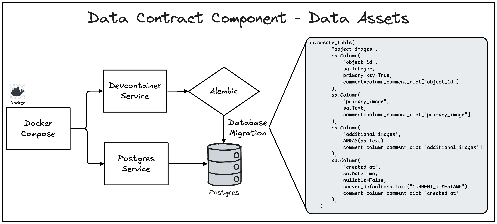
Figure 7-3: Data Contract Component - Data Assets

Note that the sandbox environment has two similar files `docker-compose.test.yml` and `docker-compose.yml`. The former is used within our CI/CD pipelines and includes calls to run the test scripts, while the latter is used by the sandbox environment itself and runs scripts to seed the postgres database with `data_assets/raw_data/objects.json`. In the next section we will discuss how we then used the metadata defined by the database migration file to inform what to put within the data contract spec.

### Component B - Contract Definition

Once we have our most important data assets identified, we need to establish our expectations via a data contract specification file. A typical starting point is to use the current state of the data asset as the baseline for the contract spec (as in this current implementation), but you can also use it to establish a desired to state to inform your database migrations-- which we highlight in a later section. The below directory tree subset highlights the components related to contract definition.

```txt
/workspace
└── data_contract_components/                                      # Data contract components
    └── contract_definition/                                       # Data contract specifications
        └── object_images_contract_spec.json                       # Contract spec for object_images
```

We again want to iterate that creating our own data contract specification for this mock scenario is for learning purposes. It may make sense to build your own if your needs are fairly simple (e.g. schema only enforcement) or you have a company specific use case. Otherwise, it will be substantially easier to leverage existing data contract specs such as the [Open Data Contract Standard under the Linux Foundation](https://github.com/bitol-io/open-data-contract-standard) which also has a [JSON Schema adaptation](https://github.com/bitol-io/open-data-contract-standard/blob/main/schema/odcs-json-schema-latest.json).

Currently there is only one data contract spec for `object_images`, but we will add an additional contract spec for another data asset in a later stage. The contents of the `object_images_contract_spec.json` consists of the following:

```json
{
    "spec-version": "1.0.0",
    "name": "object-images-contract-spec",
    "namespace": "met-museum-data",
    "dataAssetResourceName": "postgresql://postgres:5432/postgres.object_images",
    "doc": "Data contract for the object_images table containing image URLs and metadata for museum objects, including primary images, additional images, and creation timestamps.",
    "owner": {
      "name": "Data Engineering Team",
      "email": "data-eng@museum.org"
    },
    "schema": {
      "$schema": "https://json-schema.org/draft/2020-12/schema",
      "title": "Object Images Table Schema",
      "table_catalog": "postgres",
      "table_schema": "public",
      "table_name": "object_images",
      "properties": {
        "object_id": {
          "description": "Identifying number for each artwork (unique, can be used as key field)",
          "examples": [437133],
          "constraints": {
            "primaryKey": true,
            "data_type": "integer",
            "numeric_precision": 32.0,
            "is_nullable": false,
            "is_updatable": true
          }
        },
        "primary_image": {
          "description": "URL to the primary image of an object (JPEG)",
          "examples": ["https://images.metmuseum.org/.../DT1234.jpg"],
          "constraints": {
            "primaryKey": false,
            "data_type": "text",
            "is_nullable": true,
            "is_updatable": true
          }
        },
        "additional_images": {
          "description": "Array of URLs to additional JPEG images of the object",
          "constraints": {
            "primaryKey": false,
            "data_type": "ARRAY",
            "is_nullable": true,
            "is_updatable": true
          },
          "array_element": {
            "data_type": "text"
          }
        },
        "created_at": {
          "description": "Timestamp when this record was created in the database",
          "examples": ["2025-01-15T10:30:00.000Z"],
          "items": null,
          "constraints": {
            "primaryKey": false,
            "data_type": "timestamp without time zone",
            "datetime_precision": 6.0,
            "is_nullable": false,
            "is_updatable": true
          }
        }
      }
    }
  }
```

As covered in Chapter 5, there needs to be metadata associated with managing the contract spec across its lifecycle and enabling a means to use it programmatically without conflicts. Thus we suggest the following (also highlighted in Chapter 5):

*spec-version:*  
    The version of the data contract spec utilized within your system, where this value will change with each iteration to the spec structure as your use case changes or becomes more complex (e.g. adding further semantic constraints).

*name:*  
    The user-defined name of the respective data contract, where name and namespace form a combined unique identifier.

*namespace:*  
    A user-defined name representing a collection of data contracts, similar to a higher level “folder” within a repository.

*dataAssetResourceName:*  
    The URL path of the data source under contract, where it aligns with the naming pattern of the data source (e.g. postgres://db/database-name)

*doc:*  
    The documentation that describes what the data contract represents, enforces, and any other pertinent information.

*owner:*  
    The assigned owner (either an individual or group) of the data contract, and the contact information used to notify when a contract is violated, needs a change, or if an individual is trying to determine a point of contact for further context.

Furthermore, we have the `schema` field, which has the metadata `table_catalog`, `table_schema`, `object_images`. We want to call out that this metadata is for making it easier to work with postgres for this mock scenario. A more robust implementation, and or tool, would account for different data assets such as application code, multiple database types, or connecting directly to a data catalog. In addition, emphasis should be adhering to the pattern illustrated here rather than treating the specific naming and structure as dogma.

Finally, we want to call out the need to account for nested variables such as `object_images.additional_images` which is an array of strings, and its meta data nested under that value. While this is a relatively straight forward task to extract the metadata of a single-layer nested value from Postgres, adding further layers and different types of data asset sources increases the complexity substantially-- especially in the detection component of data contract violations. In the next section, we will detail how this sandbox environment detects changes to the Postgres database, and create a simple "data catalog" for the purpose of data contract validation.

### Component C - Detection

Detection of data contracts requires three key components: 1) detect what exists in the current state of the data asset, 2) detect what data contract specifications exist, and 3) compare these two sources and detect violations if they exist. The below subset of the directory tree highlights the detection component.

```txt
/workspace
└── data_contract_components/                                      # Data contract components
    └── detection/                                                 # Data contract violation detection
        ├── _get_data_catalog.py                                   # Data catalog retrieval
        ├── _get_data_contract_specs.py                            # Contract specifications retrieval
        ├── contract_coverage_detector.py                          # Contract coverage analysis
        └── contract_violation_detector.py                         # Contract violation detection
```

As illustrated in Figure 7-4, within this sandbox, the scripts `contract_coverage_detector.py` and `contract_violation_detector.py` extracts metadata from Postgres and the contract specs from the `data_contract_components/contract_definition/..` directory. The two sources of metadata are compared, where the contract spec is treated as the source of truth, and any violations are returned as a list.

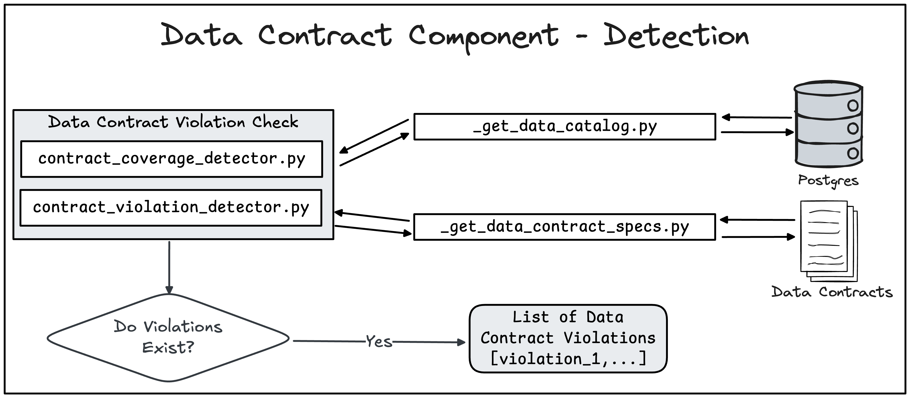
Figure 7-4: Data Contract Component - Detection

We can diver further into the two above scripts to understand how these comparisons are made. In both script snippets highlighted below, we turn the metadata from our "data catalog" and our data contract specs into two respective `DataFrames` that both have the columns `table_catalog`, `table_schema`, and `table_name`. In the case of `contract_coverage_detector.py` we do a left join, where data assets that are present in the contract spec directory but not the "data catalog" are flagged as a violation.

```python
# contract_coverage_detector.py
...
def detect_coverage_in_data_catalog(self) -> List[str]:
    coverage = self.get_contract_spec_coverage()
    coverage_df = pd.DataFrame(coverage)  
    catalog_df = get_data_catalog()
    
    merged = coverage_df.merge(
        catalog_df, 
        on=['table_catalog', 'table_schema', 'table_name'], 
        how='left', 
        indicator=True
    )
    
    missing_assets_df = merged[merged['_merge'] == 'left_only']
    missing_table_names = missing_assets_df['table_name'].tolist()
    
    return missing_table_names
```

Within `contract_violation_detector.py`, we use a similar process of creating two `DataFrames` from the "data catalog" and contract specs, but this time we are also joining on `column_name` for further granularity.

```python
# contract_violation_detector.py
...
def detect_constraint_violations(self) -> List[Dict[str, str]]:
    contract_specs_df = pd.DataFrame(self.transform_contract_specs_to_catalog_format())
    catalog_df = get_data_catalog()
    
    merged = contract_specs_df.merge(
        catalog_df,
        on=['table_catalog', 'table_schema', 'table_name', 'column_name'],
        how='left',
        suffixes=('_contract', '_catalog'),
        indicator=True
    )
...
```

As stated earlier, comparing violations beyond a single type of data asset increases complexity considerably. While we won't go into depth on this comparison logic here, please note that `contract_violation_detector.py` has an entire function, `transform_contract_specs_to_catalog_format()`, dedicated to parsing the data contract spec to match the format of the "data catalog" metadata. Again, this is one of the moments where we are erring on simplicity and explicitness for teaching purposes.

Furthermore, this is also why we highly encourage the use of a dedicated data catalog tool (there are many opn-source options available), so that the various data asset sources are abstracted into a single metadata format to compare against. You might have noticed throughout this chapter that we have been using the term "data catalog" in quotation marks so that it's clear we are *representing* a data catalog, but in reality our implementation is quite simple. Specifically, `_get_data_catalog.py` is a SQL script with a Python wrapper that reads the `information_schema` table from Postgres (i.e. where its metadata is stored); While Postgres offers even more fine-grained metadata tables, the `information_schema` table is common across many SQL-based databases. In short, this is essentially how the core functionality of data catalogs works under the hood, and we encourage checking out the script to see for yourself.

In the next section, we will detail how we embed these detections within the CI/CD workflow via unit tests, and then trigger pull request comments if violations are detected.

### Component D - Prevention

Finally, the last component is detection, as highlighted in the directory tree subset below. For this implementation, we are using GitHub Actions for our continuous integration test, as denoted by the `.github/workflows/docker-image.yml` file. Under the hood, GitHub actions is spinning up a docker container and running two jobs: `build` and `test`. The `build` job is to ensure the sandbox dev environment is working properly for our repo-- therefore, we will focus on the `test` job which gets its container configurations from `docker-compose.test.yml` (sets up postgres database with schema but does not seed the data).

```txt
/workspace
├── docker-compose.test.yml                                        # Docker compose for testing
├── .github/                                                       # GitHub configuration
│   └── workflows/                                                 # GitHub Actions workflows
│       └── docker-image.yml                                       # Docker image build workflow
└── data_contract_components/                                      # Data contract components
    ├── detection/                                                 # Data contract violation detection
    │   ├── contract_coverage_detector.py                          # Contract coverage analysis
    │   └── contract_violation_detector.py                         # Contract violation detection
    └── prevention/                                                # Data contract violation prevention
        ├── __init__.py                                            # Python package init
        └── test_data_contract_violations.py                       # Contract violation tests
```

At a high level, `docker-compose.test.yml` setups the necessary infra and installs requirements, runs the database migration file, and then performs a unit test check via the following command that then exports its log to a folder on the container that can be surfaced in a pull request comment:
```bash
python -m unittest data_contract_components/prevention/test_data_contract_violations.py -v > /workspace/test_output.log 2>&1`
```

Specifically, Figure 7-5, illustrates how `test_data_contract_violations.py` works within the CI/CD workflow on a GitHub pull request that wants to merge onto `main`. Where the unit test fails if the returned violations list from either `contract_coverage_detector.py` or `contract_violation_detector.py` has a length greater than zero.

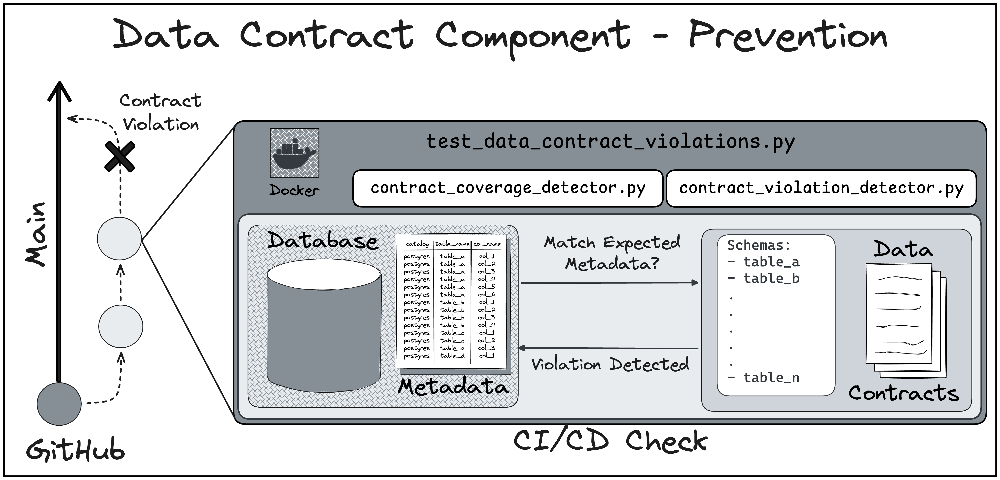
Figure 7-5: Data Contract Component - Prevention

Finally, if the test returns a violation, the log is saved and passed to GitHub via a script command in `.github/workflows/docker-image.yml`. Figure 7-6 below provides and example of a data contract violation message via GitHub pull request comment. Please note that this is a forced error by changing the values within the data contract spec to values that don't make sense (e.g. `text` -> `integer`).

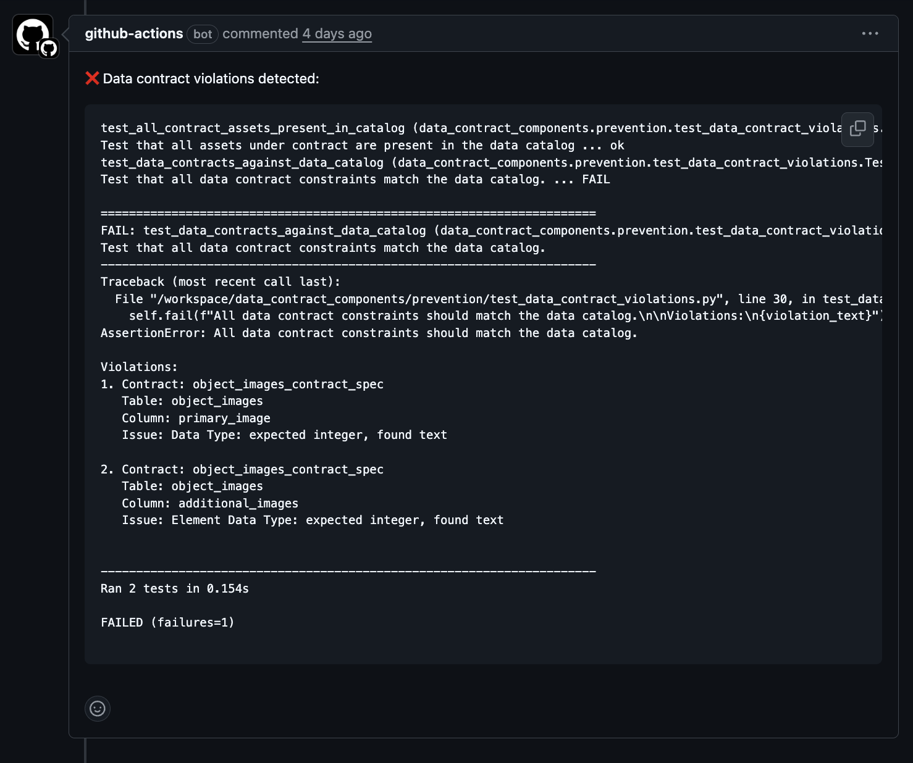
Figure 7-6: Example - Data Contract Violation Message Via GitHub Pull Request Comment

We have now completed the full data contract workflow, and should now feel comfortable navigating the sandbox yourself to create additional data contracts, or build off this repository to test out data contracts on different data asset sources. In the next section, we will summarize the entire workflow and provide a dependency graph that highlights which files to look further into when going through the data contract violation workflow.

### Putting It All Together

Over the course of the previous sections, we have detailed the four data contract components (i.e. data assets, contract definition, detection, and prevention) and how each important file within the project directory corresponds with each component and the contract violation workflow. In summary, the data contract violation workflow consist of the following:

1. GitHub Actions kicks off the CI/CD workflow.

2. The continuous integration job (i.e. `test` in `.github/workflows/docker-image.yml`) kicks off Docker Compose to build a container for the data contract violation check.

3. `docker-compose.test.yml` is used for the container in the Infrastructure Layer.

4. The container builds a service called `postgres`.

5. This `postgres` service prepares a `PostgresSQL17` database and send a "healthy" check signal to Docker Compose when complete.

6. After receiving a "healthy" check signal from `postgres`, the container also builds a service called `devcontainer` that installs Python and relevant package requirements.

7. `devcontainer` service executes the database migration file on the database within the `postgres` service via Alembic.

8. Once `devcontainer` completes installs and database setup, it runs the unit test via `test_data_contract_violations.py`.

9.  `test_data_contract_violations.py` executes `contract_coverage_detector.py` and `contract_violation_detector.py` via Python's built in unittest.

10. These two detector functions pull relevant metadata from the database within the `postgres` service and data contract spec directories via `_get_data_catalog.py` and `_get_data_contract_specs.py`.

11. The data contract spec `object_images_contract_spec.json` is referenced by `_get_data_contract_specs.py`, which enables the comparison between the database metadata and the data contract spec expectations.

12. If a data contract violation is detected, Python saves the logs from `test_data_contract_violations.py` as `test_output.log` on the `devcontainer` service.

13. The continuous integration job, `test`, finishes by checking if a test failure occurred, and if so, return `test_output.log` as a comment within the respective GitHub pull request.

Figure 7-7 below summarizes this entire workflow as a dependency graph that you can use as a guide to navigate a data contract workflow step and which file to reference.

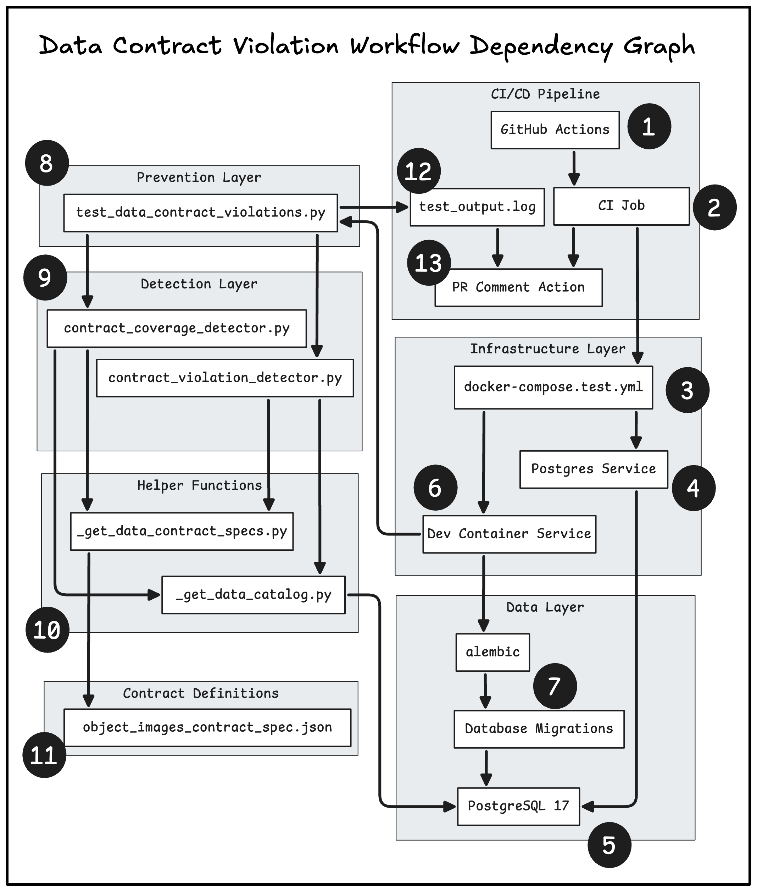
Figure 7-7: Data Contract Violation Workflow Dependency Graph

In the final section of this tutorial, we will build on our understanding of the data contract components and their respective files to conduct a mock scenario of creating a contract violating change, going through violation process, and then using data contracts to inform what changes should exist.

## Data Contract Violation Scenario

Again, in our mock scenario the backend software engineering team is tasked with creating the OLTP database that will support a new product line of the entertainment software business. In the previous section we took on the persona of the data platform engineer who implemented the data contract components. Moving forward, we are now taking on the persona of the backend software engineer who is going through the contract violation workflow.

### I - Received request to normalize the `object_images` table

Specifically, you received a request to normalize the `object_images` table by unnesting `object_images.additional_images`, renaming `primary_image` to `image`, and creating a boolean called `is_primary_image`.

```text
-- Current                                 -- Requested
┌────────────────────────────────────┐     ┌─────────────────────────────────┐
│        object_images               │     │       object_images             │
├────────────────────────────────────┤     ├─────────────────────────────────┤
│ PK: object_id (Integer)            │     │ PK: object_id (Integer)         │
│     primary_image (Text)           │ --> │     image (Text)                │
│     additional_images (ARRAY[text])│     |     is_primary_image (Boolean)  |
│     created_at (DateTime)          │     |     created_at (DateTime)       │
└────────────────────────────────────┘     └─────────────────────────────────┘
```

The request makes sense as this aligns with the goals of this database and will make working with the images data more straightforward. In addition, since it's early days of the development, you are only aware of the backed software engineering team needing this database that's not even connected to the application yet. Thus, you also believe it makes sense to drop the table completely so you implement the most up-to-date version of `object_images` within the transactional database.

### II - Update data migration file for new schema

First, you create a new branch with the following command in your terminal:

```bash
git checkout -b 'update-objects-images-schema'
```

Now in a development branch, within `data_assets/db_migrations/versions/00e9b3375a5f_create_met_museum_seed_tables.py` you update the database migration file to reflect the correct schema of the `object_images` table by replacing this code with the following update:

```python
# old schema to replace
    op.create_table(
        "object_images",
        sa.Column(
            "object_id",
            sa.Integer,
            primary_key=True,
            comment=column_comment_dict["object_id"]
        ),
        sa.Column(
            "primary_image",
            sa.Text,
            comment=column_comment_dict["primary_image"]
        ),
        sa.Column(
            "additional_images",
            ARRAY(sa.Text),
            comment=column_comment_dict["additional_images"]
        ),
        sa.Column(
            "created_at",
            sa.DateTime,
            nullable=False,
            server_default=sa.text("CURRENT_TIMESTAMP"),
            comment=column_comment_dict["created_at"]
        ),
    )

# new schema for `object_images`
    op.create_table(
        "object_images",
        sa.Column(
            "object_id",
            sa.Integer,
            primary_key=True,
            comment=column_comment_dict["object_id"]
        ),
        sa.Column(
            "image",
            sa.Text,
            comment=column_comment_dict["primary_image"]
        ),
        sa.Column(
            "is_primary_image",
            sa.Boolean,
            comment="Identifies if its the primary image for the object."
        ),
        sa.Column(
            "created_at",
            sa.DateTime,
            nullable=False,
            server_default=sa.text("CURRENT_TIMESTAMP"),
            comment=column_comment_dict["created_at"]
        ),
    )
```

You then run the following commands in your terminal to remove the all the tables and seeded data from Postgres in your development area, and then implement new database migration with `object_images` updates:
```bash
cd ~/../workspace/data_contract_components/data_assets
alembic downgrade base
alembic upgrade head
```

You should expect the following logs from Alembic:
```bash
(update-objects-images-schema) $ alembic downgrade base
INFO  [alembic.runtime.migration] Context impl PostgresqlImpl.
INFO  [alembic.runtime.migration] Will assume transactional DDL.
INFO  [alembic.runtime.migration] Running downgrade 00e9b3375a5f -> , create met museum seed tables

(update-objects-images-schema) $ alembic upgrade head
INFO  [alembic.runtime.migration] Context impl PostgresqlImpl.
INFO  [alembic.runtime.migration] Will assume transactional DDL.
INFO  [alembic.runtime.migration] Running upgrade  -> 00e9b3375a5f, create met museum seed tables
```

### III - Check unit tests and trigger contract violation

Before pushing your change to your remote branch, you first go back to your root directory folder, `workspace`, and run your unit tests locally via the following commands:

```bash
cd ~/../workspace
python -m unittest data_contract_components/prevention/test_data_contract_violations.py -v
```

To your surprise, you receive the following failed test for the exact two fields you updated. It looks like the data platform engineering team has finally implemented data contracts in this repository.

```bash
(update-objects-images-schema) $ python -m unittest data_contract_components/prevention/test_data_contract_violations.py -v
test_all_contract_assets_present_in_catalog (data_contract_components.prevention.test_data_contract_violations.TestContractViolations.test_all_contract_assets_present_in_catalog)
Test that all assets under contract are present in the data catalog ... ok
test_data_contracts_against_data_catalog (data_contract_components.prevention.test_data_contract_violations.TestContractViolations.test_data_contracts_against_data_catalog)
Test that all data contract constraints match the data catalog. ... FAIL

======================================================================
FAIL: test_data_contracts_against_data_catalog (data_contract_components.prevention.test_data_contract_violations.TestContractViolations.test_data_contracts_against_data_catalog)
Test that all data contract constraints match the data catalog.
----------------------------------------------------------------------
Traceback (most recent call last):
  File "/workspace/data_contract_components/prevention/test_data_contract_violations.py", line 30, in test_data_contracts_against_data_catalog
    self.fail(f"All data contract constraints should match the data catalog.\n\nViolations:\n{violation_text}")
AssertionError: All data contract constraints should match the data catalog.

Violations:
1. Contract: object_images_contract_spec
   Table: object_images
   Column: primary_image
   Issue: Column 'primary_image' is defined in contract but missing from data catalog

2. Contract: object_images_contract_spec
   Table: object_images
   Column: additional_images
   Issue: Column 'additional_images' is defined in contract but missing from data catalog


----------------------------------------------------------------------
Ran 2 tests in 0.240s

FAILED (failures=1)
```

### IV - Push to remote branch and view error logs

So that this violation is logged on the pull request, you push your local branch to your remote branch via the following commands:

```bash
git add .
git commit -m 'adding updates that caused contract violation'
git push --set-upstream origin update-objects-images-schema
```

As expected, the CI/CD checks via GitHub Actions fail as seen in Figure 7-8:

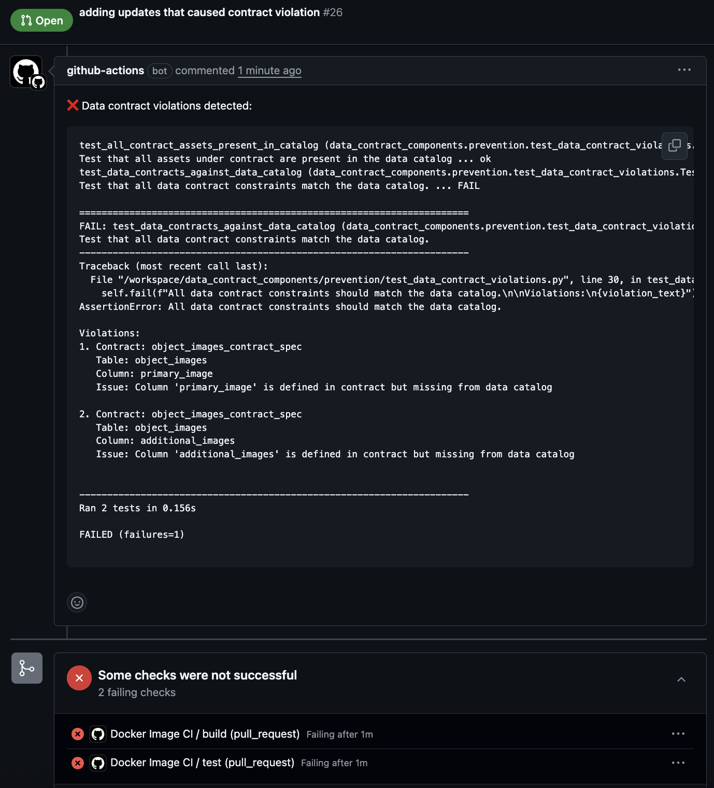
Figure 7-8: Data Contract Violation Message With Failed CI/CD Tests

This will be useful when trying to explain the issue to your colleagues.

### V - Revert db migration changes back

You undo this commit pushed to your remote branch by using the following commands:

```bash
git revert HEAD
git push
```

You also confirm that the CI/CD tests pass again as seen in Figure 7-9:
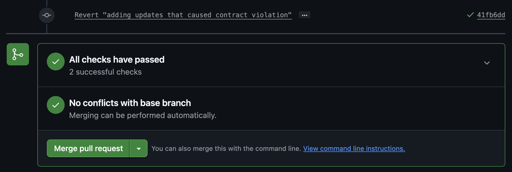
Figure 7-9: CI/CD Tests Passing Again

Your next steps are to find the data contract spec used causing your violations and determine which team you need to talk to to learn more about their needs.

### VI - Discuss with downstream team to learn use case

You locate the contract spec to `data_contract_components/contract_definition/object_images_contract_spec.json` and identify from the spec that the owner is the following:

```json
"owner": {
      "name": "Data Engineering Team",
      "email": "data-eng@museum.org"
    },
```

You reach out to the data engineering team and learn the following new information:

- The Data Science team has started their model training last week and heavily depend on `object_images`.

- With that said, having images split between `object_images.primary_image` and `object_images.additional_images`, and the latter being an array requires additional data pre-processing and business logic the data science team have to maintain.

- The data science team is excited to learn about the normalized table and agree on the change, but they need time to update their data pre-processing pipelines to account for the new schema of `object_images`.

Thus you and your stakeholders decide to 1) not drop `object_images`, 2) create a new table called `object_images_normalized`, and 3) maintain `object_images` for one month to give the data science team to transition.

### VII - Create new data contract for `object_images_normalized` table

Now that data contracts are in place, you can leverage them to define your expectations for `object_images_normalized` and use the contract violation unit test to confirm if your database migration won't cause a failure. You run the following command to create a new contract file:

```bash
touch data_contract_components/contract_definition/object_images_normalized_contract_spec.json
```

Before reading further, attempt to create your own data contract spec for `object_images_normalized` by adapting the already existing spec `object_images_contract_spec.json`. Alternatively, you can also just copy and paste the following into `object_images_normalized_contract_spec.json`:

```json
{
    "spec-version": "1.0.0",
    "name": "object-images-normalized-contract-spec",
    "namespace": "met-museum-data",
    "dataAssetResourceName": "postgresql://postgres:5432/postgres.object_images_normalized",
    "doc": "Data contract for the object_images_noralized table containing image URLs and metadata for museum objects and creation timestamps.",
    "owner": {
      "name": "Data Engineering Team",
      "email": "data-eng@museum.org"
    },
    "schema": {
      "$schema": "https://json-schema.org/draft/2020-12/schema",
      "title": "Object Images Normalized Table Schema",
      "table_catalog": "postgres",
      "table_schema": "public",
      "table_name": "object_images_normalized",
      "properties": {
        "object_id": {
          "description": "Identifying number for each artwork (unique, can be used as key field)",
          "examples": [437133],
          "constraints": {
            "primaryKey": true,
            "data_type": "integer",
            "numeric_precision": 32.0,
            "is_nullable": false,
            "is_updatable": true
          }
        },
        "image": {
          "description": "URL to the image of an object (JPEG)",
          "examples": ["https://images.metmuseum.org/.../DT1234.jpg"],
          "constraints": {
            "primaryKey": false,
            "data_type": "text",
            "is_nullable": true,
            "is_updatable": true
          }
        },
        "is_primary_image": {
          "description": "Boolean flagging if the image is a primary image for the museum.",
          "constraints": {
            "primaryKey": false,
            "data_type": "boolean",
            "is_nullable": true,
            "is_updatable": true
          }
        },
        "created_at": {
          "description": "Timestamp when this record was created in the database",
          "examples": ["2025-01-15T10:30:00.000Z"],
          "items": null,
          "constraints": {
            "primaryKey": false,
            "data_type": "timestamp without time zone",
            "datetime_precision": 6.0,
            "is_nullable": false,
            "is_updatable": true
          }
        }
      }
    }
  }
```

Our next step is to see what errors occur now that we have a new contract spec, but the database migration file doesn't reflect the new table yet.

### VIII - Run unit tests and see error for missing asset in catalog

Again, you run the following commands to reset your postgres database based on the most up-to-date database migration file:

```bash
cd ~/../workspace/data_contract_components/data_assets
alembic downgrade base
alembic upgrade head
```

Afterwards, you also run the unit test command again:

```bash
cd ~/../workspace
python -m unittest data_contract_components/prevention/test_data_contract_violations.py -v
```

As expected, you get the following errors message highlighting your new data contract existing but not present in the data catalog:

```bash
AssertionError: False is not true : All assets under contract should be present in data catalog.
Missing: ['object_images_normalized']

======================================================================

AssertionError: All data contract constraints should match the data catalog.

Violations:
1. Contract: object_images_normalized_contract_spec
   Table: object_images_normalized
   Column: object_id
   Issue: Column 'object_id' is defined in contract but missing from data catalog

2. Contract: object_images_normalized_contract_spec
   Table: object_images_normalized
   Column: image
   Issue: Column 'image' is defined in contract but missing from data catalog

3. Contract: object_images_normalized_contract_spec
   Table: object_images_normalized
   Column: is_primary_image
   Issue: Column 'is_primary_image' is defined in contract but missing from data catalog

4. Contract: object_images_normalized_contract_spec
   Table: object_images_normalized
   Column: created_at
   Issue: Column 'created_at' is defined in contract but missing from data catalog


----------------------------------------------------------------------
Ran 2 tests in 0.213s

FAILED (failures=2)
```
Again, you push the local changes to your remote branch so that the errors are logged on the pull request.

```bash
git add .
git commit -m 'added new contract, but need to update the db migration file still'
git push
```

Thus, your next step is to update the database migration file to add the data asset `object_images_normalized` until you no longer receive data contract violations from the unit tests.

### IX - Fix db migration until all checks pass

Again, you run the following commands to reset your postgres database but only `alembic downgrade base`:

```bash
cd ~/../workspace/data_contract_components/data_assets
alembic downgrade base
```

Before reading further, attempt to update `data_contract_components/data_assets/db_migrations/versions/00e9b3375a5f_create_met_museum_seed_tables.py` to include the creation of the `object_images_normalized` table. When you are done, you should have the following code snippet added under `def upgrade() -> None:`:

```python
    op.create_table(
        "object_images_normalized",
        sa.Column(
            "object_id",
            sa.Integer,
            primary_key=True,
            comment=column_comment_dict["object_id"]
        ),
        sa.Column(
            "image",
            sa.Text,
            comment="URL to the image of an object (JPEG)"
        ),
        sa.Column(
            "is_primary_image",
            sa.Boolean,
            comment="Identifies if its the primary image for the object."
        ),
        sa.Column(
            "created_at",
            sa.DateTime,
            nullable=False,
            server_default=sa.text("CURRENT_TIMESTAMP"),
            comment=column_comment_dict["created_at"]
        ),
    )
```

And the following snippet under `def downgrade() -> None:` to ensure you properly clean the database with the new table:

```python
def downgrade() -> None:
    """Downgrade schema."""
    op.drop_table("object")
    op.drop_table("object_history")
    op.drop_table("object_physical_properties")
    op.drop_table("object_gallery_info")
    op.drop_table("object_tags")
    op.drop_table("object_images")
    op.drop_table("object_images_normalized") #add this line
    op.drop_table("object_copyright")
    op.drop_table("object_api_metadata")
```

Again, you run the following commands to setup your postgres database with the new `object_images_normalized` table:

```bash
cd ~/../workspace/data_contract_components/data_assets
alembic upgrade head
```

Finally you run the unit test command to confirm there are no more violations:

```bash
cd ~/../workspace
python -m unittest data_contract_components/prevention/test_data_contract_violations.py -v
```

You can confirm that the unit test return no failures for the data contract violation check:

```bash
test_all_contract_assets_present_in_catalog (data_contract_components.prevention.test_data_contract_violations.TestContractViolations.test_all_contract_assets_present_in_catalog)
Test that all assets under contract are present in the data catalog ... ok

test_data_contracts_against_data_catalog (data_contract_components.prevention.test_data_contract_violations.TestContractViolations.test_data_contracts_against_data_catalog)
Test that all data contract constraints match the data catalog. ... ok

----------------------------------------------------------------------
Ran 2 tests in 0.176s

OK
```

Your final step is to push your change to your remote branch to confirm the CI/CD checks will pass.

### X - Push to remote branch and see it pass

You run the following git commands to push your local branch to remote and view the GitHub Actions logs:

```bash
git add .
git commit -m 'adding updated spec and db migration file for object_images_normalized'
git push
```

As confirmed in Figure 7-10, all of our tests are passing now for both the new contract spec and new data asset `object_images_normalized'`.

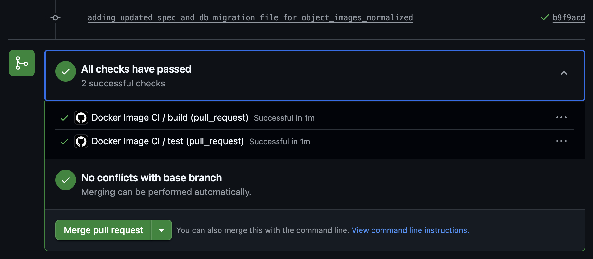
Figure 7-10: CI/CD Tests Passing Again After Database Change

With the tests passing, it's now time to request a colleague for code review and ultimately merge this code to the `main` branch.

## Conclusion

This concludes the mock scenario and tutorial for implementing data contracts. In this chapter we provided full walkthrough of a data contract architecture implementation and its corresponding scripts. In addition, we detailed how to implement your own data contract specs for the purpose of learning, and provided you the tradeoffs of managing your own data contract spec. Finally, we closed out the chapter with a mock scenario imitating what a data producer will experience throughout the data contract violation workflow.

Walking away from this chapter, you should have been able to achieve the following:

1. Understand how to implement the four data contract components: 1) data assets, 2) data contract spec, 3) detection, and 4) prevention.

2. Create a data contract spec via JSON Schema as a means to understand how to evaluate available specs on the market or whether to build one your own for specific use cases.

3. Learn how to leverage the metadata of databases to create your own "data catalog" that you will compare data contract specs to.

4. Embed data contracts within unit tests for local testing and embedding within the CI/CD workflow.

5. Fully walk through the data contract violation workflow on a pull request.

Again, we want to highlight that this implementation and sandbox environment is intended for learning purposes. Scaling beyond a few a data contracts increases the complexity of of managing their lifecycle, and thus you should strongly consider the tradeoffs of building your own, leveraging an open-source tool, or buying a dedicated product (e.g. data catalog service) for each component of the data contract architecture.

In the next chapter, we continue moving away from just theory and present three unique real-world case studies of data contracts in production from companies we interviewed for the book.
